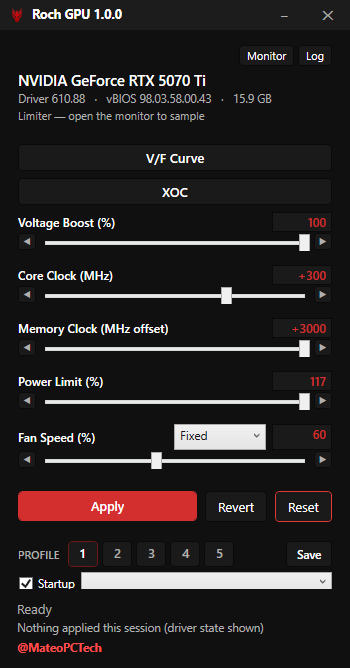
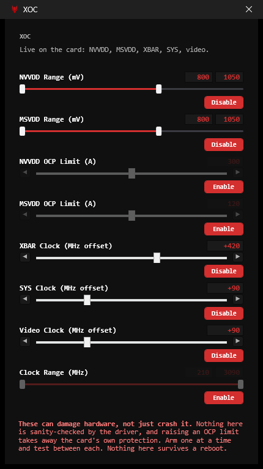
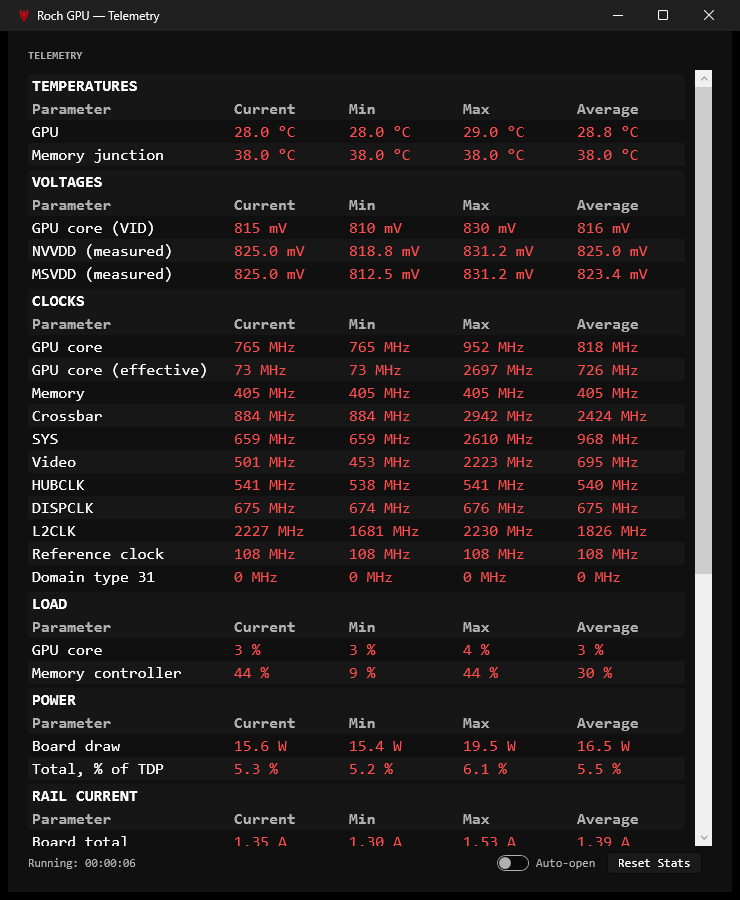
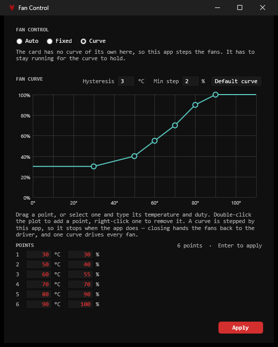
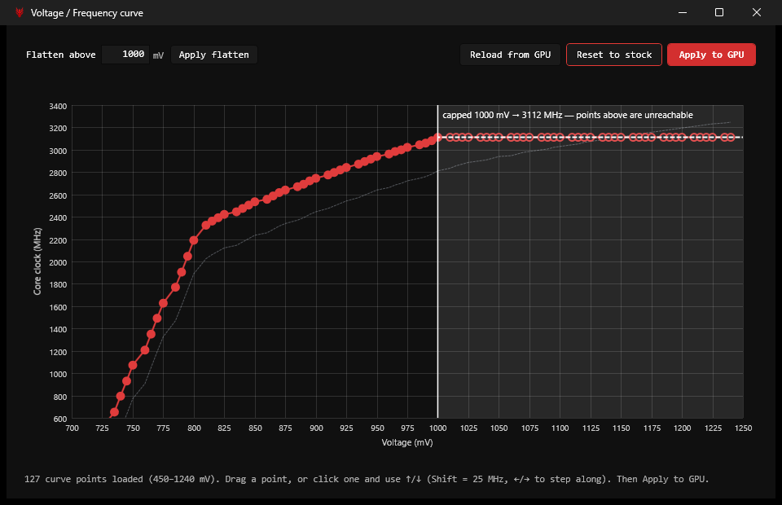
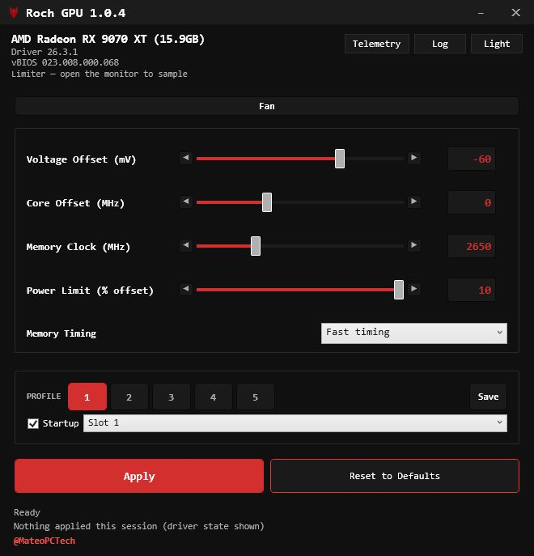
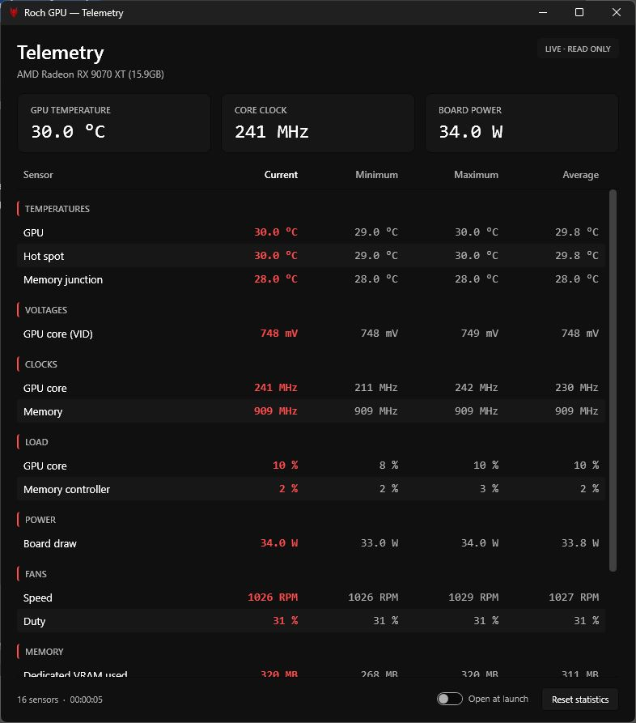



# Roch GPU

[](https://github.com/RochStudio/Roch-GPU/actions/workflows/ci.yml)

An Afterburner-style GPU tuning tool for Windows that drives **both NVIDIA and AMD** cards from
**one executable**. Clocks, voltage, power limit, fan control, live monitoring, a V/F curve editor,
and five profile slots.

No kernel driver — everything goes through the vendors' own user-mode libraries (`nvapi64.dll`,
`atiadlxx.dll`), the same route Afterburner and Adrenalin take.

**`RochGPU.exe` is the whole program.** Run it with nothing and you get the window; run it with a
command and you get the CLI. Nothing to install — no .NET runtime, no DLLs beside it.

> Writing clocks and voltages to a GPU can crash, corrupt work in progress, and in the extreme
> damage hardware. Read the [warning](#a-word-of-warning) before using it.

---

## Screenshots

**NVIDIA** — the full set, with the rails and crossbar behind XOC and the V/F curve editor.

| Main window | Extreme OC (XOC) | Hardware monitor |
|---|---|---|
|  |  |  |





**AMD (RX 9070 XT)** — the same binary against a different driver. The window is built from what
the card reports, so it comes out differently: a voltage *offset* rather than a curve, an absolute
memory clock rather than a delta, plus memory timing and zero RPM. XOC and the curve editor are
missing entirely because RDNA 4 exposes neither — hidden rather than shown greyed out.

| Main window | Hardware monitor |
|---|---|
|  |  |

---

## Tested GPUs

The tool asks the driver what it supports rather than assuming, so other cards should work. These
are the ones actually run against hardware:

| GPU | Driver | Status |
|---|---|---|
| **RTX 5070 Ti** (Blackwell) | 610.88 | Full feature set, including the V/F curve editor and everything behind XOC — both rails, and a crossbar offset that lands and reads back. |
| **RTX 4070 Ti** (Ada) | 591.86 | Everything except the two Blackwell-only levers: the MSVDD rail, and the crossbar *write* — that domain is present and measurable, but the driver refuses any non-zero offset. NVVDD works. |
| **RTX 4070** (Ada) | — | Same as the 4070 Ti: works, without MSVDD or the crossbar write. |
| **RX 9070 XT** (RDNA 4) | Adrenalin 25.x, 26.3.1 | The AMD feature set: clocks, undervolt offset, power limit, zero RPM, memory timing, hardware fan curve. No editable V/F curve or temperature limit on RDNA 4. |

---

## What you get

The UI is built from what the driver reports, so the controls change with the card rather than
showing everything greyed out.

| Control | NVIDIA | AMD (RDNA+) |
|---|---|---|
| Core clock | offset, 15 MHz steps | offset, MHz |
| Memory clock | offset, 25 MHz steps | absolute clock |
| Voltage boost | %, raises the ceiling | — |
| Voltage cap | in the curve editor's flatten | offset, mV (undervolt) |
| NVVDD rail | floor and ceiling, mV | — |
| MSVDD rail | floor and ceiling, mV — Blackwell only | — |
| Measured rail voltages | NVVDD and MSVDD, mV | — |
| XBAR clock | offset, MHz — writable on Blackwell only | — |
| Clock range | pin the graphics clock to a min/max window | — |
| NVVDD / MSVDD OCP | over-current limit, A — Blackwell | — |
| SYS clock | offset, MHz | — |
| Video clock | offset, MHz | — |
| HUBCLK, DISPCLK, L2CLK, reference | read-only, in the monitor | — |
| Power limit | % of TDP | % offset |
| Temperature limit | ✓ | driver-owned, hidden |
| Fan | a duty per fan, or a software curve | one duty, or a hardware curve |
| Zero RPM / memory timing | — | ✓ |
| V/F curve editor | ✓ | no editable curve on RDNA 4 |

Fan control is its own window too — a duty per fan, or a curve — and applying there saves the fan
settings into the active profile slot, so what you set is what comes back at logon.

Plus a hardware monitor in its own window — a table of every sensor the card reports, with
its current, minimum, maximum and running average, grouped and foldable — five profile slots,
apply-at-logon, tray operation and the CLI.

Nothing polls the driver unless a window is showing live readings — the monitor, or the fan window
with its per-fan RPM. Close both and there is no driver call at all, so the main window can sit on a
second screen costing nothing while you play.

Offsets snap to the driver's own granularity, so the number on the slider is the number that reaches
the card. The sliders are also narrowed to a range worth dragging — **−150 to +750 MHz** on core and
crossbar, against the ±1000 the driver reports. That ±1000 is the width of the driver's delta field,
not a claim about the silicon.

Both ends are slider ends rather than measurements. The travel is long because these are the offsets
a card reaches once the rails are raised and the boost is wound open, which are nothing like the ones
a stock card holds — a 5070 Ti runs +420 on the crossbar and reads it back, five times the
double-digit gains published for that domain. Nothing up there is known to be stable, and the
crossbar in particular is sanity-checked by the driver not at all: too high an offset browns the card
out rather than failing.

### V/F curve editor

Reads the card's real table (103 points to 1090 mV on a 4070 Ti, 127 to 1240 mV on a 5070 Ti) and
plots what the card will actually do rather than what is stored.

Drag a point, or select one and use ↑/↓ to nudge it by a 5 MHz step (Shift = 25, Ctrl also flattens
everything above it). Double-click resets a point, right-click resets all. **Flatten above N mV** is
the undervolt, and is where the voltage cap lives.

The cap is measured against the ceiling the card can actually reach, and that moves with the boost:
a 5070 Ti tops out at 1035 mV stock and 1100 mV with the boost wound fully open, so a cap anywhere
in between holds it under load rather than doing nothing.

A marker shows where the card actually stops — the table describes voltages well above anything a
given card selects, so the unreachable stretch is shaded rather than left looking tunable.

### Fan control

Its own window, from the **Fan** button. Three modes:

- **Auto** — the driver's own behaviour.
- **Fixed** — a duty per fan. A card that reports several coolers gets a slider each, because the
  driver addresses them separately: on a 5070 Ti, ids 1, 2 and 3 each have their own policy, level
  and tachometer. *Move together* is on by default and drives them as one.
- **Curve** — points against temperature, dragged on the plot or typed as a table underneath, with
  every point listed rather than only the selected one. Double-click the plot to add a point,
  right-click one to remove it.

A curve is stepped by this app on NVIDIA, so it stops when the app does, and the app asks before
closing while one is running. On AMD the curve is the driver's own and needs nothing resident.

**Apply writes the card and saves the fan settings into the active profile slot**, leaving the rest
of that profile alone. Applying and saving are separate elsewhere — for clocks that is right, you
try a value before you keep it — but the reason to set a curve is for the machine to run it,
including after a reboot, so a curve that was applied and never saved is a trap rather than a
choice.

### Light and dark

One button, top right, showing the mode you are in — a Light/Dark pair would spend half its width
naming the mode you are not in. It switches everything already on screen, including the title bars
Windows draws rather than WPF, and the choice is remembered. The palette and the font (Consolas) are
[Roch Viewer](https://github.com/RochStudio/Roch-Viewer)'s, value for value.

### Extreme OC (XOC)

The **XOC** button holds the levers that can brown a card out rather than merely fail: the NVVDD and
MSVDD rail ranges, the two OCP current limits, the crossbar, SYS and video clocks, and the clock
range. Each has **its own
Enable/Disable button**, showing the action rather than the state, and is off by default. On the
40-series cards tested only NVVDD is usable — the other two are Blackwell-only, and controls the
card doesn't support are hidden rather than shown greyed out.

They are armed separately because they fail in unrelated ways: a rail ceiling that browns the card
out says nothing about whether a crossbar offset is stable, and having to arm both to test either is
how a session ends up unable to say which of two changes hung it.

**The OCP limits** are the current at which the card cuts in to protect itself — 300 A on NVVDD and
120 A on MSVDD as a 5070 Ti ships. They are their own private family, not part of the rail controls,
and the sliders offer half the stock figure to half again above it: that is the bound the driver
itself enforces, not one invented here. Disarming restores the stock figure rather than leaving the
last value written, because an OCP limit survives a reboot and a card left with its protection wound
off is a state nobody chose and nothing on screen would show.

The rails go to **1200 mV** on a 5070 Ti — 145 mV over the card's own base, and deliberately more
than air cooling can use. Nothing on air is thermally able to sit up there; the travel is offered
for water and LN2, where what a card will hold is a different question. 1200 is the figure the rail
status struct itself carries, though the driver has been seen taking a ceiling of 1280 mV before
clamping, so treat it as a plausible boundary rather than a proven one.

Enable and Disable write that one lever immediately and touch nothing else — not the other levers,
and not the clocks, power or fan. What is armed travels with the profile, so a normal **Apply**
respects it: an armed lever writes your value, a disarmed one goes back to the driver's own. A rail
ceiling left standing from an earlier session is exactly what browns a card out on the next boot,
and rail offsets survive a reboot, so each default is recorded the first time a GPU is seen and
restored from there.

---

## Running it

Grab `RochGPU.exe` from the [latest release](../../releases/latest) and run it. That's the whole
install — it is self-contained, so no .NET runtime is needed.

It asks for administrator rights when the window opens, because writing clocks needs them. The CLI
half does not ask, so read-only commands work from any terminal:

```powershell
.\RochGPU.exe info          # what was detected, and every limit the driver reports
.\RochGPU.exe info --mock   # a simulated GPU, for a machine with no supported card
```

### Command line

Same executable, same engine, no window. The first word decides which half runs — a command gives
you the CLI, no arguments gives you the window.

One quirk of shipping both halves in one file: it is a GUI-subsystem executable, so a shell does not
wait for it. The prompt comes back immediately and the output arrives a moment later, underneath it.
Redirect (`RochGPU.exe diag > out.txt`) if you want to capture it.

```
info                          what was detected, and every limit the driver reports
monitor [--interval 1000]     live telemetry until Ctrl+C
apply --core 120 --mem 800 --power 110 --fan 60
apply --volt 25 --uv -100     voltage boost %, and an undervolt in mV under the ceiling
apply --nvvdd 1100 --msvdd 1050 --xbar 30 --sys 45 --video 30
apply --clock-min 1500 --clock-max 1800
                              pin the graphics clock; give one side only to pin at it
                              the gated levers — passing a flag arms that lever for that
                              apply, and any lever you do not name goes back to the
                              driver's own value
apply-profile "Slot 1"        apply a profile saved in the GUI
reset                         everything back to driver defaults
diag                          full dump: capabilities, raw tables, sensors
startup --enable <profile> | --disable | --status
```

`--gpu <n>` selects the card, `--mock` uses the simulated GPU. Anything that writes needs an elevated
terminal; `info`, `monitor` and `--mock` do not.

The **Startup** tick in the window registers the same task as `startup --enable`, and unticking it
removes the task rather than only clearing the tick. The task applies the profile and then leaves the
app in the tray, so a *software* fan curve (NVIDIA) keeps running — something has to stay alive to
step it. Clocks, limits and voltages would have survived either way, and AMD's fan curve is the
driver's own.

Because it is already running, opening the app from the desktop afterwards brings that copy back from
the tray rather than starting a second one. Two elevated copies writing the same card is not a state
worth allowing, and the check happens before the elevation prompt, so a redundant launch costs
nothing.

It does not appear in Task Manager's Startup tab: that list reads the Run registry key and the
Startup folder, and neither can run elevated without a prompt at every logon. A Scheduled Task can,
which is why it is one — manage it there, or with `startup --disable`.

---

## Building from source

You need **Windows 10/11 x64**, the [.NET 10 SDK](https://dotnet.microsoft.com/download/dotnet/10.0)
(`winget install Microsoft.DotNet.SDK.10`) and your existing GPU driver.

```powershell
git clone https://github.com/RochStudio/Roch-GPU.git
cd Roch-GPU
powershell -ExecutionPolicy Bypass -File .\build.ps1
```

That builds, tests and publishes `dist\RochGPU.exe`. If you don't have the SDK, `SETUP.bat` does the
lot in one double-click.

**Tests:** `dotnet run --project tests/GpuTuner.Core.Tests -c Release` → `283 passed, 0 failed`. The
runner is dependency-free — the whole project has no NuGet packages at all — so most of the engine
can be changed without a GPU in front of you.

<details>
<summary>If the build fails</summary>

| Symptom | Cause |
|---|---|
| `does not support targeting .NET 10.0` | SDK older than 10.0 — check `dotnet --list-sdks`. |
| `...\dist\... is denied` | The app is still running, tray icon included. |
| Builds fine, writes silently do nothing | Not elevated. |

`.\dist\RochGPU.exe diag` prints exactly what the driver reported, which is usually the answer.

</details>

---

## How it works

`IGpuBackend` is the vendor-neutral seam, and `BackendFactory` picks a backend by *trying to
initialise each one* rather than sniffing device IDs — which is why one executable covers both
vendors with no per-card build.

On NVIDIA, clocks go through `SetPStates20` and limits through the client policy calls. Voltage is
the awkward one — NVIDIA exposes no voltage slider, so an undervolt is a V/F curve operation,
computed arithmetically from one absolute mV target and applied as a clock-boost lock. On AMD it is
Overdrive 8 over ADL, where a feature whose min equals its max is one the card doesn't expose, which
is how the UI knows what to hide.

Everything that can be verified is verified: writes are read back, and the status bar says when the
card reports something different from what was asked. Several vendor calls return success and then
do nothing, so "the call succeeded" is not treated as evidence.

---

## A word of warning

This writes voltage, clock and power settings to your GPU.

- Overclocking and undervolting can crash, corrupt work in progress, and in the extreme damage
  hardware. It may void your warranty.
- Change one thing at a time, test it, and write down what worked.
- **Reset** returns everything to driver defaults, and is the first thing to try if the card
  misbehaves.
- A fan curve is enforced by this app on NVIDIA (closing it hands fans back to the driver — you are
  asked first) and by the driver itself on AMD.
- On AMD, a memory timing change and a large undervolt are the likeliest causes of instability.

Provided as-is, with no warranty. You are responsible for what you do to your own hardware.

---

## Known limitations

- **The SYS and video clock offsets both work, and neither is worth much yet.** Video was confirmed
  against third-party monitoring. SYS is idle-gated, which made it look inert at first: the domain
  sits pinned near 660 MHz with nothing to do, and an offset of +300 changes that by nothing at all.
  Under load it runs about 2378 MHz and the offset lands on the MHz — +105 measured +104, +300
  measured +299, and returning to zero came back to 2374. It buys no frames on the one workload
  tested, 3DMark 11 Graphics Test 2 at 1440p scoring 74.99 against 75.01, so the clock moves and the
  bottleneck is elsewhere.
  Check a domain with `RochGPU.exe domains`, which reads each one's own counter — but **check it
  under load**. Monitoring tools do not expose the SYS clock, and an idle reading of it says nothing.
- **The crossbar clock is tunable on Blackwell, read-only on Ada.** A 5070 Ti takes a +30 MHz offset
  and reads it back. A 4070 Ti reports a ±1000 MHz range and refuses every non-zero value while 0
  succeeds — a rejection of the value, not of the request shape, so that range is the width of the
  delta field rather than a promise.
- **MSVDD is Blackwell-only.** The rail control is present on a 5070 Ti and absent on the 40-series
  cards tested, where NVVDD works on its own.
- **Hot spot and memory chip temperature are not exposed on Blackwell.** Not a gap in the reading:
  the thermal call has three versions, and the driver names them itself when handed a wrong one
  (`Ver-1:1003c Ver-2:200a8 Ver-3:334c8`, packing as version|size). v2 is the 0xA8 struct already in
  use; v3 is 0x34C8 bytes and wants its mask at +0x08 rather than +0x04, laying out eight channels
  of 0x8C as a reading plus a type. Read that way, a 5070 Ti populates exactly two of the eight —
  GPU and memory junction — with 255 °C in the rest, the same marker v2 uses for an absent sensor.
  Hot spot and the memory chip reading are in neither version. `RochGPU.exe diag` prints all eight
  slots, so a card that populates more will show it — [a sample dump from this
  card](docs/diag-rtx5070ti.txt) is kept as the evidence behind these findings.
- **Ten clock domains, and the info struct only lists nine of them.** Core, crossbar, SYS and video
  have their own controls; HUBCLK, DISPCLK, L2CLK and the reference clock are read-only readings in
  the monitor. The names come from mVolt's telemetry tab and were checked rather than trusted —
  reading both tools at once, their figures and ours agree to within about 2 MHz on every domain
  (HUBCLK 539/540, DISPCLK 674/676, L2CLK 1679/1681, reference 107/108), and type 20 tracks the core
  clock under load exactly as an L2 clock should.
  The reference clock is the reason this list is built by asking the frequency counter for every type
  id rather than by walking the info struct: the walk misses type 22 entirely, though the counter
  answers for it perfectly well. Both are used, because the walk carries type 31 — a domain that
  reads a flat zero, which a probe keeping only what moves would drop. Type 31 stays unnamed; mVolt
  does not name it either, and a number with no name is more honest than a name with no evidence.
- **The crossbar is a single flat offset, not a curve.** HYDRA 2.3B carries a 127-entry
  `xbar_curve_points` array beside its 127 `curve_points`, which suggests a per-voltage-point
  crossbar table. There isn't one on this driver, and all three places it could live were checked:
  the 127-point V/F space is entirely the core curve (its points continue monotonically to 1240 mV /
  3247 MHz, with no second domain in it); each domain's 772-byte control block holds one type word
  and the flat offset field this tool already writes; each domain's 1072-byte info entry holds 12-13
  scattered scalars with a longest run of 4 — a per-point table would be a run of about 127.
  HYDRA's own saved profile has that array all-zero, so it has never written one either.
  `RochGPU.exe diag` prints all four domain blocks and info entries, so a card that does carry a
  table will show it as a long run.
- **No temperature limit on Blackwell, and the power limit's ceiling is the driver's own.** HYDRA
  offers a 90 °C limit and power to 150 %; on a 5070 Ti neither is something the driver will
  discuss. The thermal policy family answers both of its entry points (`ClientThermalPoliciesGetInfo`
  and `GetLimit`) with zero policies, in both struct versions it accepts (v1 and v2 — it refuses
  anything newer, with no list of alternatives), and pre-filling the count does not change that, so
  it is not the mask trap. HYDRA's native helper embeds only the *Set* entry point for that family
  and none of the reads: it writes a limit blind, with the same v2 struct, and never asks whether
  there was a policy to write to. Power is the same shape one step over — the info struct reports
  83.3 / 100 / 116.7 % and accepts only v1, so there is no newer version carrying a bigger number,
  while HYDRA embeds only `SetStatus` and pairs it with `NvAPI_RestartDisplayDriver`. A write past
  the reported maximum was tried, elevated, at idle, with the same v1 struct that works at the
  maximum: 120 % and 150 % both come back `NVAPI_INVALID_ARGUMENT` (-5) and the read-back stays at
  116 667, while 116 667 itself is accepted (status 0) as the control. The driver refuses rather
  than clamps, so HYDRA's 150 % cannot be landing through this call either; whatever its driver
  restart is for, it is not this. `RochGPU.exe diag` prints the read-only probe under *Policy
  shapes*.
- **Live MSVDD voltage is not readable.** Its ceiling and floor are set and read back, but the
  voltage it actually runs at is not, making it the one control here without read-back verification.
- **A display driver reset drops the tune, and nothing puts it back.** When a game hangs the card
  hard enough for Windows to reset the driver (`nvlddmkm` in the system event log), the voltage
  lock goes with it — the log shows the cap reading back as 0 mV afterwards — while the clock and
  memory offsets survive. Apply again to restore it. The app itself recovers: NVML sessions do not
  survive a reset, and one that does not is now thrown away and reopened rather than failing every
  call until the app is restarted.
- **Nothing guards an apply-at-logon that crashed the machine.** If a tune hangs the card on boot,
  the logon task will apply it again on the next one. Hold Shift during logon to skip it, or clear it
  with `startup --disable` from another account or safe mode.
- The AMD core-clock offset is a **ceiling**, not a shift. A power-limited card will ignore it —
  check the limiter line before concluding it's broken.
- Clock snapping applies to **offsets**. A card reporting an absolute memory clock (AMD) is left
  unsnapped, since rounding its stock clock would overclock it just from reading its state.
- RDNA 4 exposes no editable V/F curve and no temperature limit; both are hidden rather than faked.
- The V/F curve editor is NVIDIA-only. Multi-GPU is implemented but untested.
- vBIOS flashing is deliberately out of scope. The release binary is unsigned, so SmartScreen will
  warn on first run.

---

## Repository layout

```
roch-gpu.sln               solution
assets/                    logo.svg (banner), icon.png, RochGPU.ico, screenshots/
docs/                      a sample `diag` dump, kept as evidence for the known limitations
build.ps1                  build + test + publish to dist\
setup.ps1                  as above, plus SDK install and launch (driven by SETUP.bat)
src/GpuTuner.Core          engine: backend abstraction, NVIDIA + AMD backends, mock, profiles, fan curve
src/GpuTuner.App           the executable — WPF window, and the entry point that picks a half
src/GpuTuner.Cli           the command-line half, compiled into the same executable
tests/GpuTuner.Core.Tests  dependency-free test runner (283 checks, no hardware needed)
tools/amd                  read-only PowerShell probes used to map the AMD driver surface
.github/workflows/ci.yml   build + test on Linux, publish + smoke-test on Windows
third_party/NvAPIWrapper   vendored NvAPIWrapper (LGPL-3.0) — see THIRD-PARTY-NOTICES.md
```

---

## Credits

- [NvAPIWrapper](https://github.com/falahati/NvAPIWrapper) by Soroush Falahati — the NVAPI binding,
  vendored and retargeted to .NET 10.
- [RadeonTuner](https://github.com/dumbie/RadeonTuner) by dumbie — its Overdrive 8 code revealed the
  in/out parameter convention that had blocked the AMD backend.
- AMD's [ADL](https://gpuopen-librariesandsdks.github.io/adl/) and
  [ADLX](https://gpuopen.com/manuals/adlx/) documentation.

## Licence

GPL-3.0-or-later. See [LICENSE](LICENSE), the same licence as
[Roch Viewer](https://github.com/RochStudio/Roch-Viewer).

This program is distributed in the hope that it will be useful, but WITHOUT ANY WARRANTY; without
even the implied warranty of MERCHANTABILITY or FITNESS FOR A PARTICULAR PURPOSE. It writes clocks
and voltages to a graphics card; run it on hardware you are willing to experiment with.

Third-party components keep their own licences; see
[THIRD-PARTY-NOTICES.md](THIRD-PARTY-NOTICES.md).
